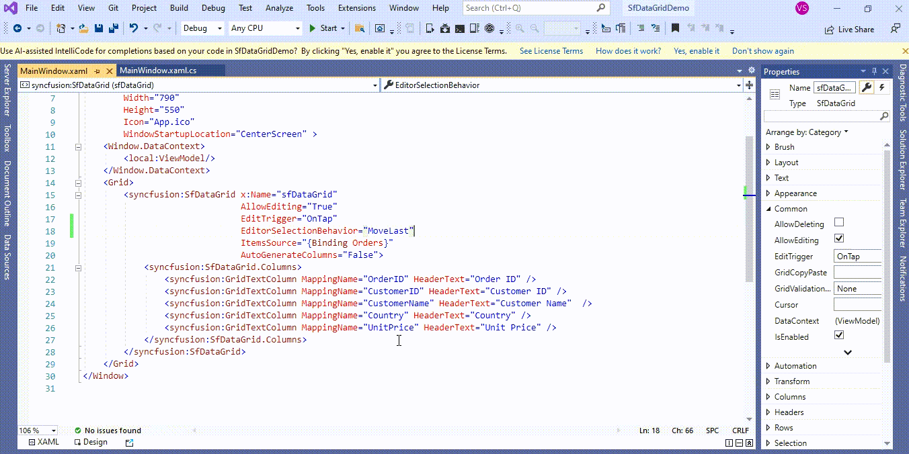

# How to set the cursor position based on mouse clicked position while editing in WPF DataGrid (SfDataGid)?

## About the sample
This example illustrates how to set the cursor position based on mouse clicked position while editing in [WPF DataGrid](https://www.syncfusion.com/wpf-controls/datagrid) (SfDataGid)? 

[WPF DataGrid](https://www.syncfusion.com/wpf-controls/datagrid) (SfDataGrid) cell enters into edit mode, cursor is placed based on [EditorSelectionBehavior](https://help.syncfusion.com/cr/wpf/Syncfusion.UI.Xaml.Grid.SfGridBase.html#Syncfusion_UI_Xaml_Grid_SfGridBase_EditorSelectionBehavior) property. You can set the cursor position based on mouse clicked position while editing by overriding the [OnEditElementLoaded](https://help.syncfusion.com/cr/wpf/Syncfusion.UI.Xaml.Grid.Cells.GridCellTextBoxRenderer.html#Syncfusion_UI_Xaml_Grid_Cells_GridCellTextBoxRenderer_OnEditElementLoaded_System_Object_System_Windows_RoutedEventArgs_) method in [GridCellTextBoxRenderer](https://help.syncfusion.com/cr/wpf/Syncfusion.UI.Xaml.Grid.Cells.GridCellTextBoxRenderer.html).

```C#

//customize the TextBoxCellRenderer 
this.sfDataGrid.CellRenderers.Remove("TextBox");
this.sfDataGrid.CellRenderers.Add("TextBox", new GridCellTextBoxRendererExt());

public class GridCellTextBoxRendererExt : GridCellTextBoxRenderer
{  
     protected override void OnEditElementLoaded(object sender, RoutedEventArgs e)
     {
          base.OnEditElementLoaded(sender, e);
          var uiElement = sender as TextBox;
          //set the CaretIndex based on clicked text position
          uiElement.CaretIndex = uiElement.GetCharacterIndexFromPoint(Mouse.GetPosition(uiElement), true);
     }
}

```

[WPF DataGrid](https://www.syncfusion.com/wpf-controls/datagrid) (SfDataGrid) provides support for various built-in column types. Each column has its own properties and renderer for more details please refer the below documentation link.

**Documentation Link:** https://help.syncfusion.com/wpf/datagrid/column-types



Take a moment to peruse the [WPF DataGrid - Editing](https://help.syncfusion.com/wpf/datagrid/editing) documentation, where you can find about editing with code examples.

KB article - [How to set the cursor position based on mouse clicked position while editing in WPF DataGrid (SfDataGid)?](https://www.syncfusion.com/kb/12622/how-to-set-the-cursor-position-based-on-mouse-clicked-position-while-editing-in-wpf)

## Requirements to run the demo
Visual Studio 2015 and above versions
